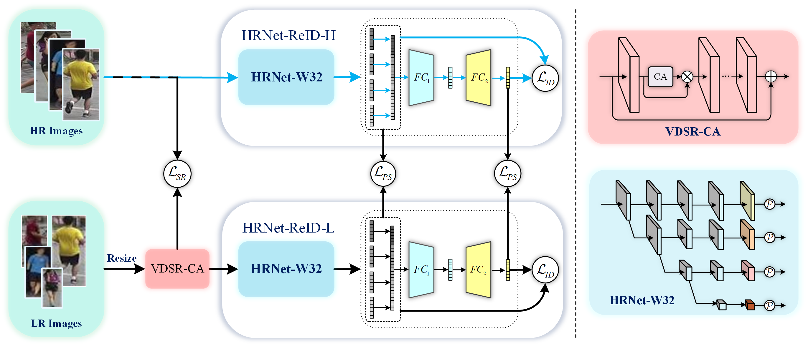

  
# Deep-High-Resolution Representation Learning for Cross-Resolution Person Re-identification
Journal of IEEE Transactions on Multimedia (Under review) | arXiv:3660003 [cs.CV] 21 Mar 2021

## Contents :clipboard:
1. [Introduction](#introduction)
2. [Usage](#usage)
3. [Results](#results)
4. [Acknowledgements](#acknowledgements)

## Introduction :bookmark:

We propose a Deep High-Resolution Pseudo-Siamese Framework (PS-HRNet) to solve the cross-resolution person re-ID problem. Specifically, in order to restore the resolution of low-resolution images and make reasonable use of different channel information of feature maps, we introduce and innovate VDSR module with channel attention (CA) mechanism, named as VDSR-CA. Then we reform the HRNet by designing a novel representation head to extract discriminating features, named as HRNet-ReID. In addition, a pseudo-siamese framework is constructed to reduce the difference of feature distributions between low-resolution images and high-resolution images. The experimental results on five cross-resolution person datasets verify the effectiveness of our proposed approach. Compared with the state-of-the-art methods, our proposed PS-HRNet improves 3.4%, 6.2%, 2.5%,1.1% and 4.2% at Rank-1 on MLR-Market-1501, MLR-CUHK03, MLR-VIPeR, MLR-DukeMTMC-reID, and CAVIAR datasets, respectively.

## Usage

We use apex (A PyTorch Extension) a Pytorch extension with NVIDIA-maintained utilities to streamline mixed precision and distributed training. Some of the code here will be included in upstream Pytorch eventually. The intention of Apex is to make up-to-date utilities available to users as quickly as possible.Installation instructions can be found here: https://github.com/NVIDIA/apex#quick-start.

We display the process of the algorithm as an ipynb file, you can use jupyter notebook to view and run it.

You may need HRNet-W32-C ImageNet pretrained models or learn more about HRNet: https://github.com/HRNet/HRNet-Image-Classification.git.

## Results :trophy:

## Acknowledgements :thumbsup:

- This code is built on [HRNet-Image-Classification](https://github.com/HRNet/HRNet-Image-Classification) and [Person_reID_baseline_pytorch](https://github.com/layumi/Person_reID_baseline_pytorch). We thank the authors for sharing their codes. To the great spirit of open source!
- Thank [Z.Dong](https://github.com/dzc2000) and [H.Wang](https://github.com/Rockdow), they are the most important contributors to the related work of the experiment. If you have any questions in the process of testing, you can send them by email or pose issues.
- Thanks for the right to use the GPU workstation provided by Nanyang Technological University.
